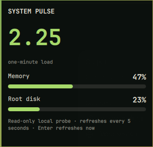

# System Pulse

A quiet Omarchy bar widget for one-minute load, memory use, and root-disk pressure. It deliberately reports a small set of slow-changing signals instead of pretending to be a full monitoring suite.



## Install

```sh
omarchy plugin add https://github.com/rookepoole/omarchy-system-pulse.git --enable
```

Click the heart to open the detail panel. Press Enter to refresh immediately. The bar mark changes when memory or disk pressure crosses 75% and 90%.

## Dependencies and permissions

Requires Omarchy Quattro and standard Arch utilities already present on Omarchy: POSIX `sh`, `awk`, and `df`. The probe is a constant command that only reads `/proc/loadavg`, `/proc/meminfo`, and `df -P /`. It interpolates no user input, makes no network requests, requests no privileges, and writes no files.

## Remove

```sh
omarchy plugin remove io.github.rookepoole.system-pulse
```

## License

MIT © 2026 Rooke Poole.
